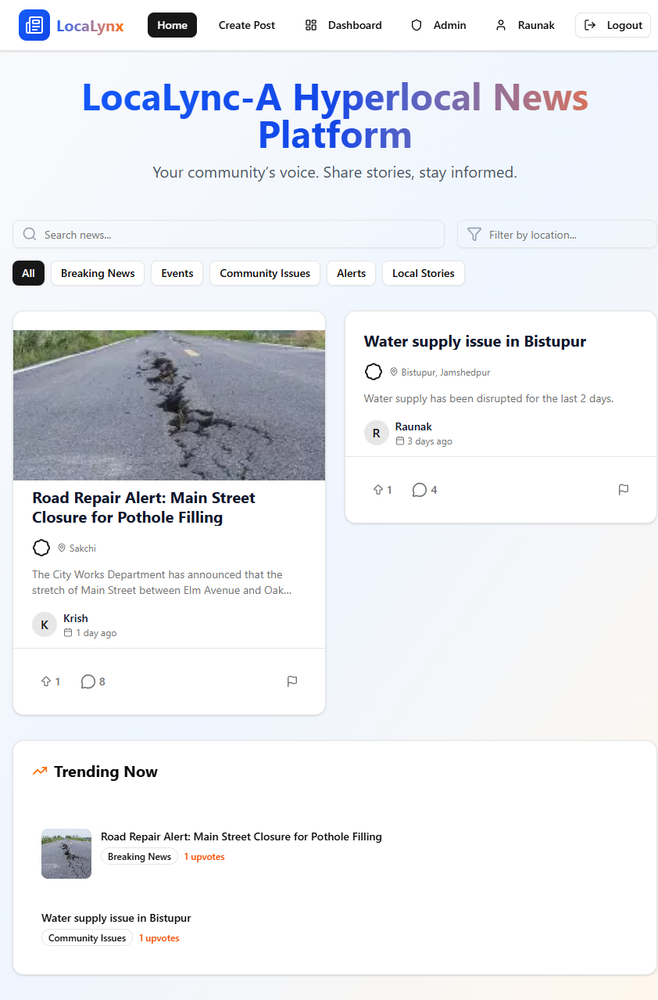
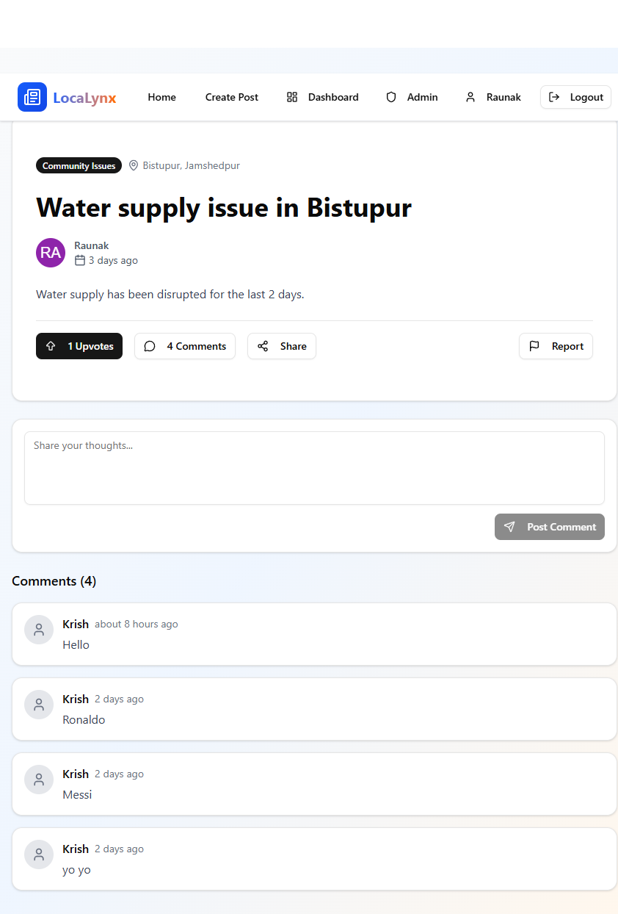
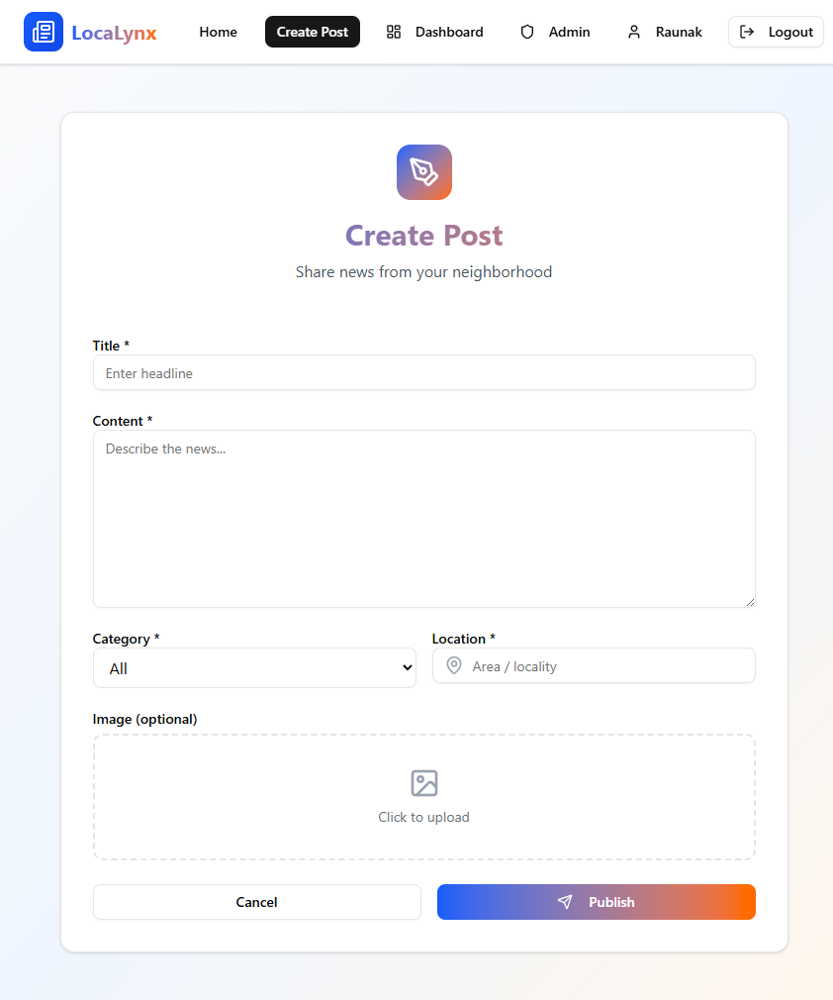
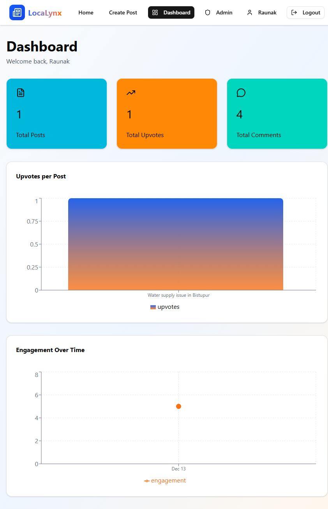
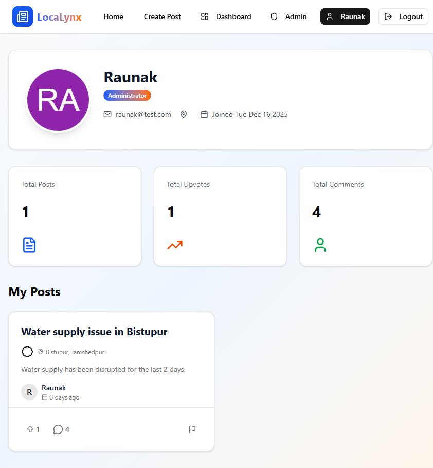
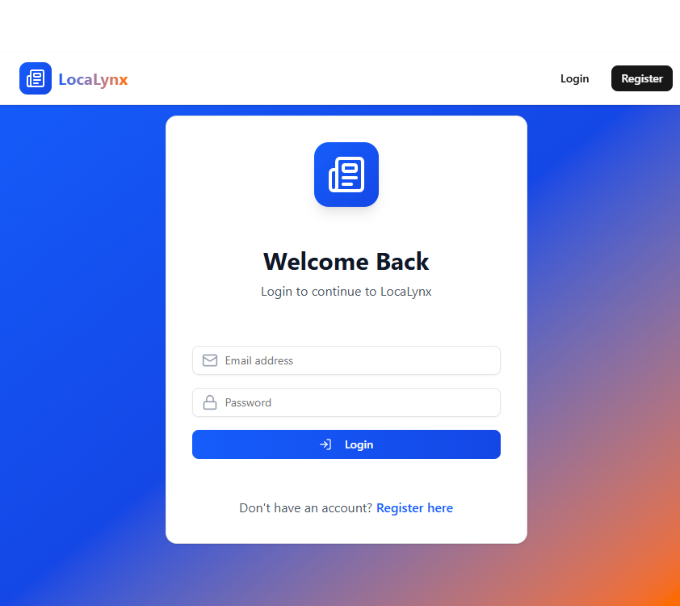
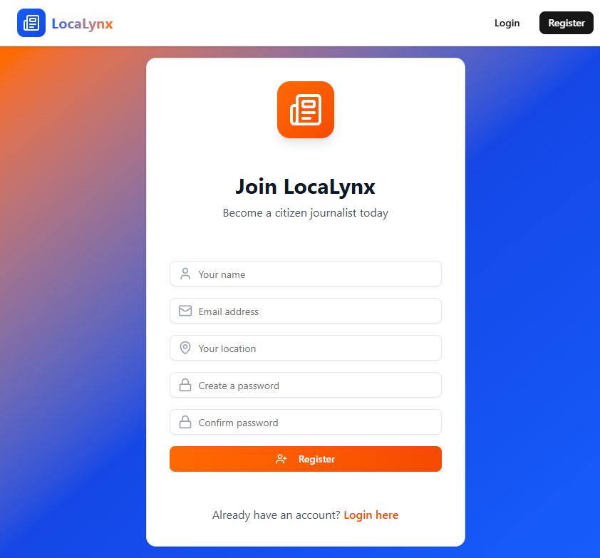

# 📰 LocaLynx — A Hyperlocal News Platform

**LocaLynx** is a full-stack **hyperlocal news platform** that empowers citizens to report, discover, and engage with news happening **around them** — from street-level issues to community updates.

Built with a modern **MERN stack**, LocaLynx focuses on **community-driven journalism**, real-time engagement, and local transparency.

---

## 🚀 Getting Started

LocaLynx can be run **locally** (recommended) or deployed using platforms like **Vercel** and **Render**.

---

## 🧪 Running Locally

### 1️⃣ Clone the Repository
```bash
git clone https://github.com/raunak-1703/Local-News-Platform.git
cd Local-News-Platform
```

### 2️⃣ Install Dependencies
**Frontend**
```bash
cd frontend
npm install
```

**Backend**
```bash
cd ../backend
npm install
```

### 3️⃣ Setup Environment Variables

**Backend (backend/.env)**
```bash
PORT=3000
MONGO_URI=your_mongodb_connection_string
JWT_SECRET=your_jwt_secret
CLOUDINARY_CLOUD_NAME=your cloudinary cloud name
CLOUDINARY_API_KEY=your cloudinary api key
CLOUDINARY_API_SECRET=your cloudinary secret key
```

**Frontend (frontend/.env)**
```bash
VITE_API_URL=http://localhost:3000/api
VITE_CLOUDINARY_CLOUD_NAME=your cloudinary cloud name
VITE_CLOUDINARY_UPLOAD_PRESET=cloudinary upload preset
```

### 4️⃣ Start the Application
**Backend**

cd backend
```bash
npm run dev
```

**Frontend**
```bash
cd frontend
npm run dev


Open in browser → http://localhost:5173
```

---

## 🌍 Deployment
```text
# Frontend (Vercel)
Build command: npm run build

# Backend (Render)
Build command: npm install
Start command: npm start
```
---
## 🌟 What Problem Does LocaLynx Solve?

Mainstream news often overlooks **local voices** and **neighborhood-level issues**.  
LocaLynx bridges this gap by:

- Giving **ordinary citizens a voice**
- Highlighting **hyperlocal events & problems**
- Encouraging **community participation**
- Ensuring **transparent moderation**

---

## ✨ Core Features

### 📝 Community-Driven News
- Create posts about local incidents, events, or announcements.
- Categorized posts (Community, Crime, Infrastructure, Events).

### 👍 Upvotes & Engagement
- Readers can **upvote posts**.
- Trending posts highlighted by engagement.

### 💬 Comment System
- Logged-in users can comment on posts.
- Encourages discussion and civic awareness.

### 📍 Location-Based Filtering
- Filter and view news posts by **location**.
- Makes local issues easier to discover.

### 🚨 Reporting & Moderation
- Users can **report inappropriate or false posts**.
- Admin panel for reviewing and moderating content.

### 👤 User Profiles
- View user details and activity stats.
- Track posts, upvotes, and engagement history.

### 📊 Dashboard Analytics
- Personal dashboard showing:
  - Total posts
  - Total upvotes
  - Total comments
- Interactive charts for engagement metrics.

### 🔐 Authentication & Authorization
- Secure **JWT-based authentication**.
- Role-based access (User / Admin).

---

## 🎥 Demo & Media

### 🎬 Project Demo Video
> *(Click the link below to watch the demo)*  
▶️ **[Watch Demo Video](https://youtu.be/D3I2NcFsaMw)**


### 🖼️ Screenshots

| Page | Preview |
|------|---------|
| Home Page |  |
| Post Details |  |
| Create Post |  |
| Dashboard |  |
| Admin Panel |  |
| Profile Page |  |
| Login Page |  |
| Register Page |  |

                                                                          


---

## 🛠️ Tech Stack

### Frontend
- **React + Vite**
- **Tailwind CSS**
- **shadcn/ui**
- **Lucide Icons**
- **Zustand** (state management)
- **React Router**
- **Sonner** (toast notifications)
- **Recharts** (visual analytics)

### Backend
- **Node.js**
- **Express.js**
- **MongoDB + Mongoose**
- **JWT Authentication**
- **Socket.IO** *(planned / optional for real-time updates)*

### Infrastructure
- **Vercel** — Frontend Hosting  
- **Render** — Backend Hosting  
- **MongoDB Atlas** — Cloud Database  


---

## 🚧 Future Enhancements

- 🔔 Real-time notifications using Socket.IO  
- 🗳️ Community polls & voting  
- 🧠 AI-based content moderation  
- 📱 Progressive Web App (PWA) version  
- 🗺️ Map-based news visualization  

---

## ❤️ Built With Purpose

**LocaLynx** was built to amplify **local voices**, promote **transparency**, and strengthen **community awareness** through technology.

> “Real change starts locally.” 🌍

---

## 🔗 Links

- **GitHub Repository:** https://github.com/raunak-1703/Local-News-Platform
- **Live Demo:** https://localynx.vercel.app
